build-lists: true

# **Mechanical Keyboards**
## In a Nutshell

---

### Hi I'm Cassidy and I'm addicted to keyboards

##### (hi Cassidy)

---

## What are mechanical keyboards?

---

## What are mechanical keyboards?

- A keyboard built with high quality, typically spring activated, key switches
- They became popular because of the drop in quality of keyboards in the 90s


^ Some of the first widely sold keyboards such as IBM’s Model M in the 1980s utilized mechanical switches

^ The 90s brought a wave of inexpensive rubber dome keyboards that flooded the market

^ Rubber dome keyboards represent over 90% of keyboards in use today and provide an inexpensive but often dissatisfying feel and typing experience

---

## Why mechanical keyboards

---

## Why mechanical keyboards

- Switches, framing, functionality, type print methods, key construction, PCB board, LED lighting (sharpness, brightness, adjustability), and more are far superior
- It just feels good

---

# Switches

---

# Switches

There's dozens of switch types available for mechanical keyboards.


---

# Switches

- *Linear*: Have no bump before bottoming out. They travel smoothly.
- *Tactile*: Have a bump you can feel in the key press before bottoming out.
- *Clicky*: Make an audible 'click' when typing.

---

# Switches


---

# Switches

- There's other aspects of switches that I won't cover today
  - Actuation force per switch (how hard you have to press to register a keypress)
  - Custom switches (you can take apart switches and add your own features)
  - Non-standard switch brands/types (Gateron, Matias, Topre)

---

# Keycaps

---

# Keycaps

- Keycaps make no real difference to how your keyboard works
- They are pretty
- They come in different profiles

---

# Keycap Profiles

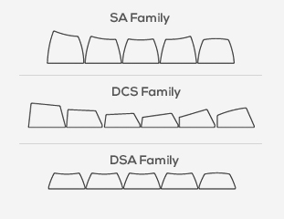

---

## SA Keycaps


---

## DCS Keycaps

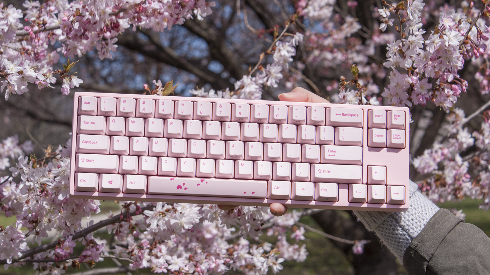

---

## DSA Keycaps

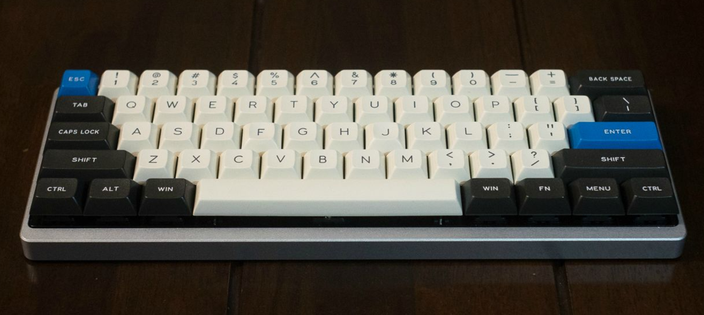

---

# Keycap Profiles

- I've gone through some of the more popular keycap profiles (there are many more)
- Some profiles and colors are more rare than others

---

# Artisan Keycaps

- Artisan keycaps are keycaps made by artisans (whaaat)
- Some are cheap, as one might expect, and some are obscenely expensive

---

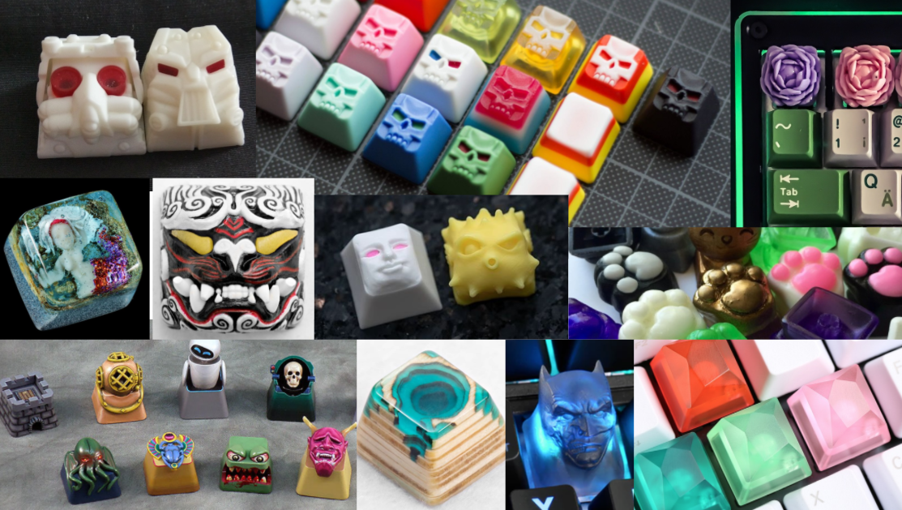

---

# Keyboard Sizes

---

# Keyboard Sizes

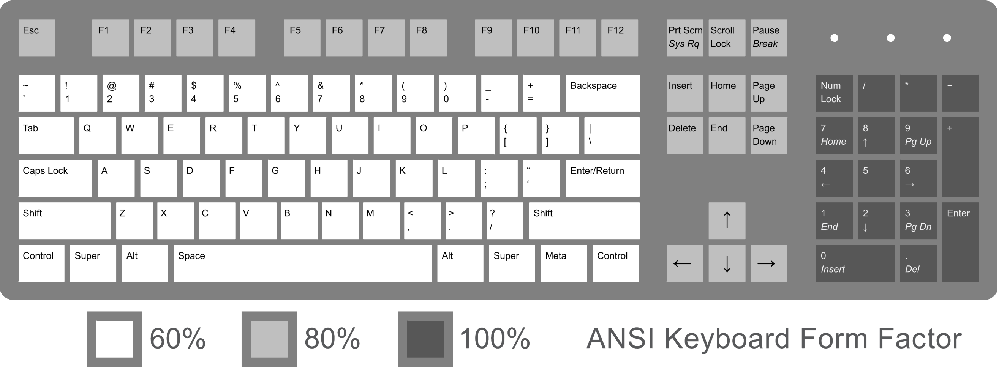

---

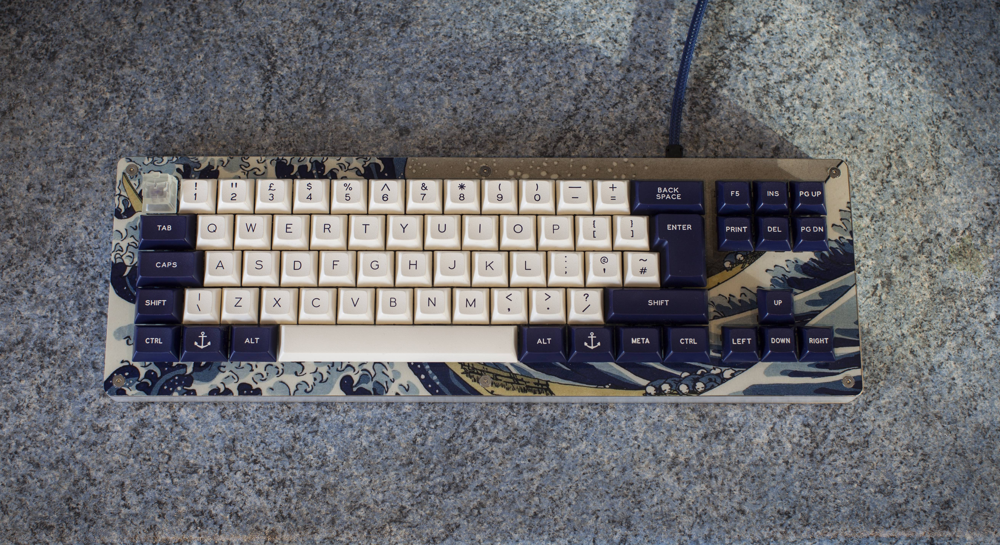

---

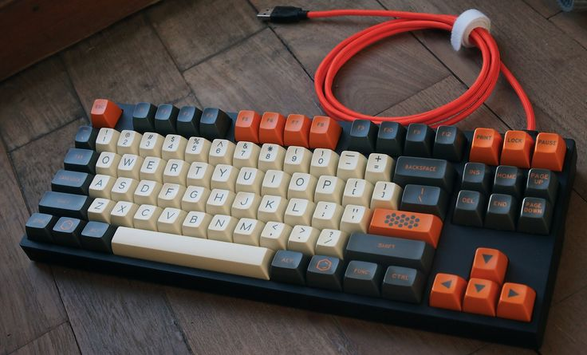

---

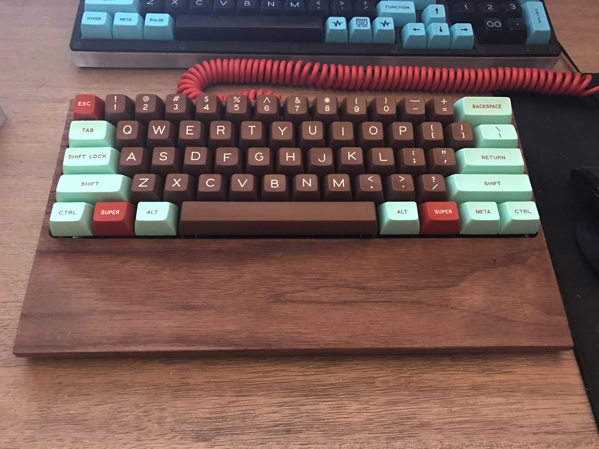

---

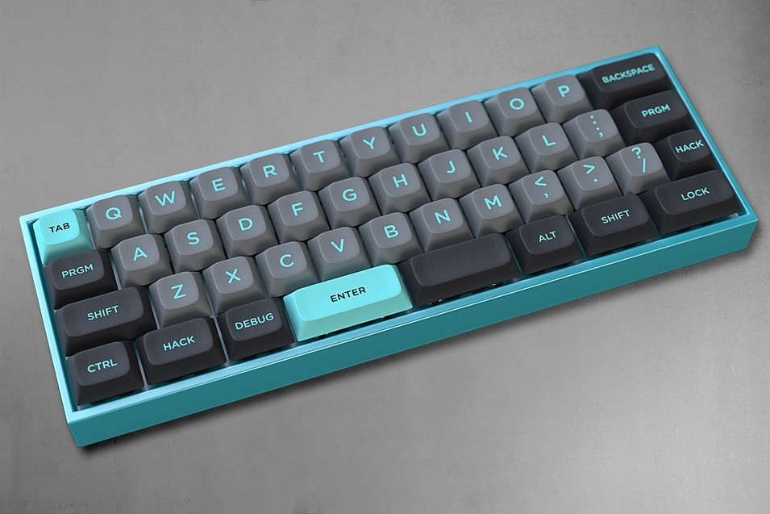

---

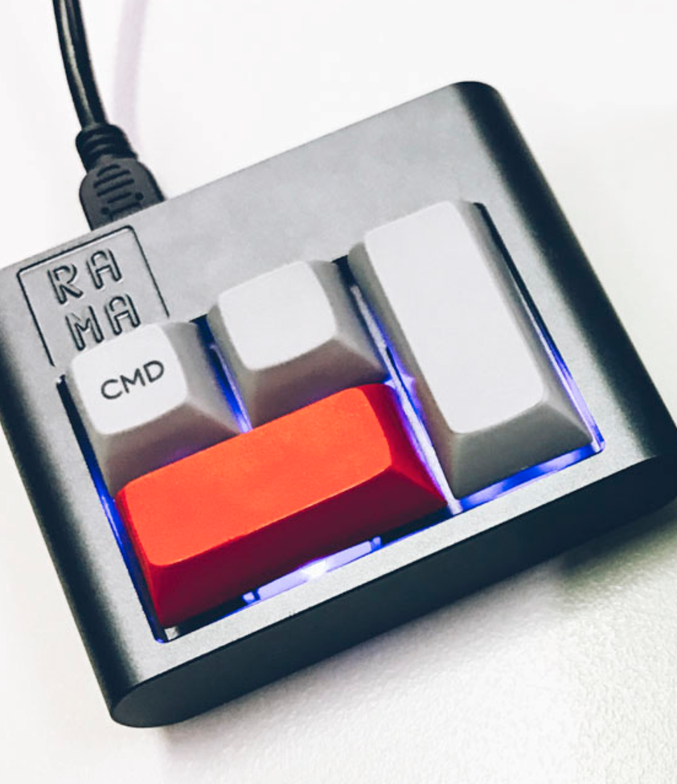

---

# Ortholinear Layouts

---


---

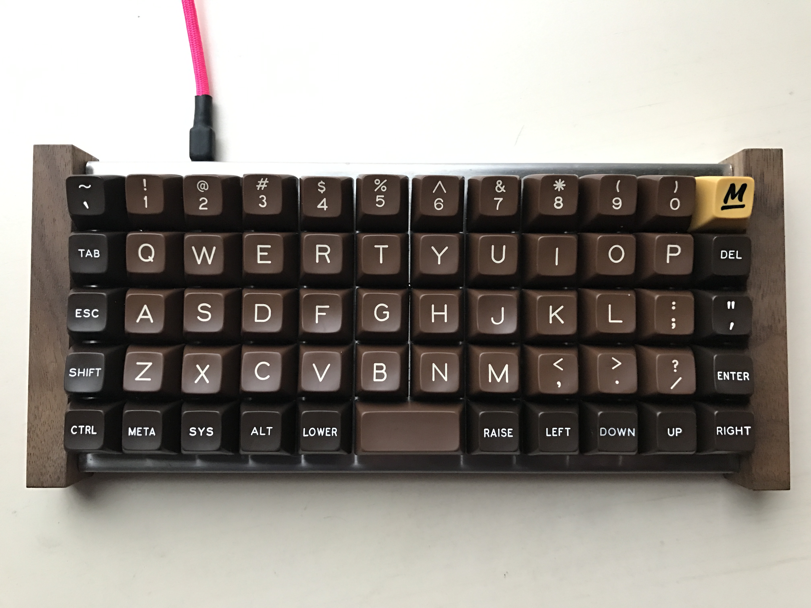

---

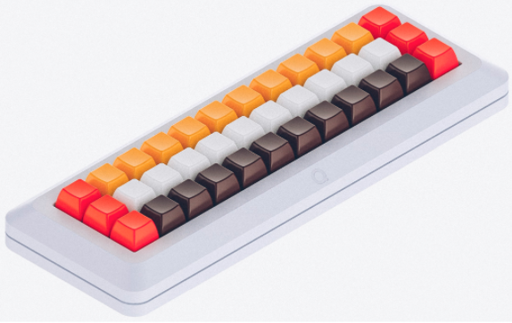

---

# Irregular Layouts

---

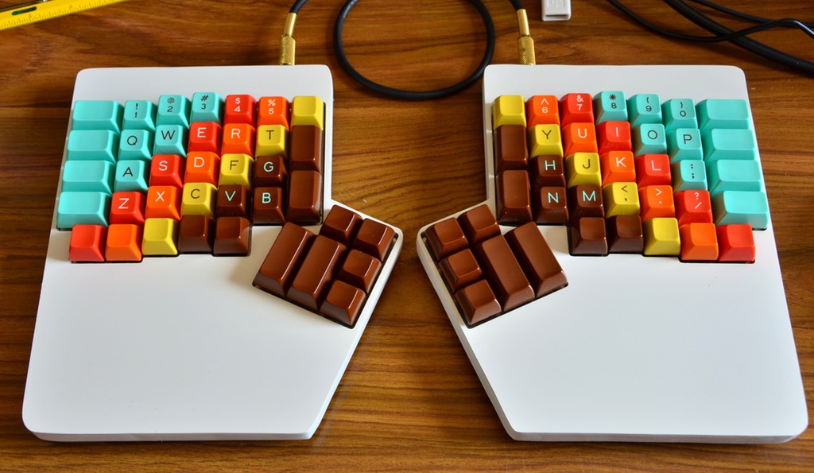

---

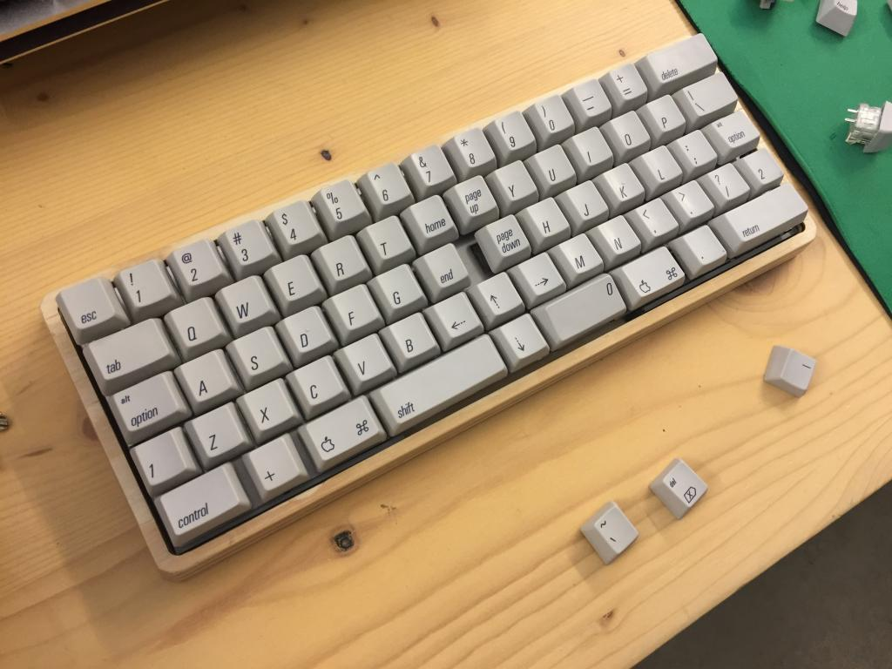

---

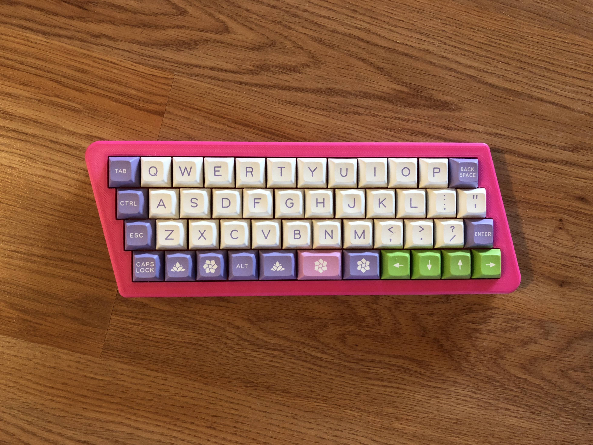

---

# Custom Cables

---

# Custom Cables

- Yes, people go so far as to getting their own custom USB cables
- It's common to get a cable that matches your keycaps
- There are kits available online for making your own, as well as ready-made ones

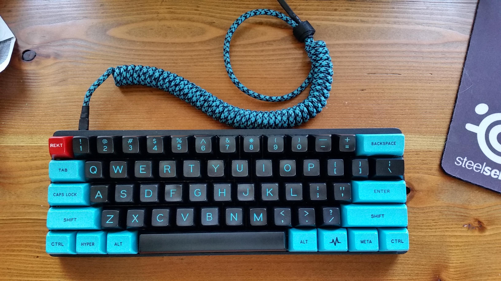

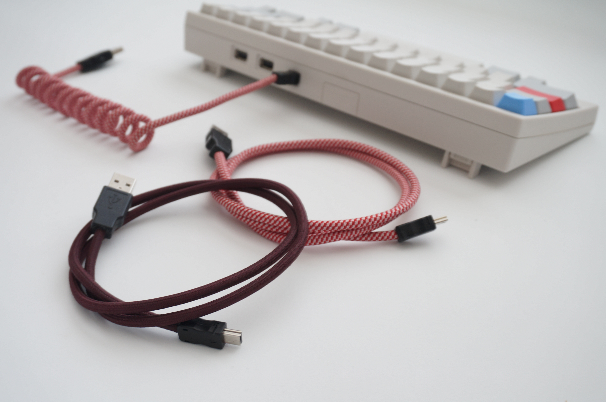

---

# Programming

---

# Programming

- The fun NEVER ENDS when programming is involved
- Many mechanical keyboards are completely programmable
  - Keymap layers
  - LED programming
  - Sometimes audio

---

# Programming

```c
const uint16_t PROGMEM keymaps[][MATRIX_ROWS][MATRIX_COLS] = {
  [_BL] = KEYMAP(
    F(0),    KC_1,   KC_2,   KC_3,   KC_4,   KC_5,   KC_6,   KC_7,   KC_8,   KC_9,   KC_0,   KC_MINS,  KC_EQL,   KC_DEL, KC_BSPC, \
    KC_TAB,  KC_Q,   KC_W,   KC_E,   KC_R,   KC_T,   KC_Y,   KC_U,   KC_I,   KC_O,   KC_P,   KC_LBRC,  KC_RBRC,  KC_BSLS, \
    MO(_FL),   KC_A,   KC_S,   KC_D,   KC_F,   KC_G,   KC_H,   KC_J,   KC_K,   KC_L,   KC_SCLN,KC_QUOT,            KC_ENT,  \
    KC_LSFT,         KC_Z,   KC_X,   KC_C,   KC_V,   KC_B,   KC_N,   KC_M,   KC_COMM,KC_DOT, KC_SLSH,            KC_RSFT,  \
    KC_LCTL, KC_LGUI,KC_LALT,          KC_SPC,                                        KC_RALT,  KC_RGUI, MO(_FL),  KC_RCTL),

  [_FL] = KEYMAP(
    KC_GRV, KC_TRNS, KC_TRNS, KC_TRNS, KC_TRNS, KC_TRNS, KC_TRNS,  KC_TRNS, KC_TRNS, KC_TRNS, KC_TRNS, KC_TRNS, KC_TRNS, RESET, KC_TRNS,  \
    KC_TRNS, KC_TRNS, KC_TRNS, KC_TRNS, KC_TRNS, KC_TRNS, KC_TRNS, KC_TRNS, KC_TRNS, KC_TRNS,   KC_TRNS,  BL_DEC,  BL_INC, BL_TOGG, \
    KC_TRNS, KC_TRNS, KC_TRNS, KC_TRNS, KC_TRNS, KC_TRNS, KC_TRNS, KC_TRNS, KC_TRNS, KC_TRNS, KC_TRNS,    KC_TRNS,     KC_TRNS, \
    KC_TRNS, RGB_TOG, RGB_MOD, RGB_HUI, RGB_HUD, RGB_SAI, RGB_SAD, RGB_VAI, RGB_VAD, KC_TRNS, KC_TRNS, KC_TRNS,  \
    KC_TRNS, KC_TRNS, KC_TRNS,          KC_TRNS,                               KC_TRNS, KC_TRNS, KC_TRNS, KC_TRNS),
  };
}
  ```

---

# Getting a Mechanical Keyboard

---

# Getting a Mechanical Keyboard

- Massdrop, GeekHack, KeyClack, and /r/mechmarket are all community-driven buy sites
- For all else: Amazon, PimpMyKeyboard.com, wasdkeyboards.com, MechanicalKeyboards.com, novelkeys.xyz, Sentraq.com, GeekKeys.com, KeyClack.com, Originative.co
- ...Or you could just ask Cassidy to help

---

# Thank you!

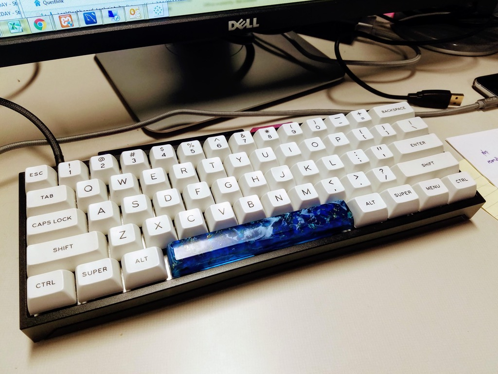
